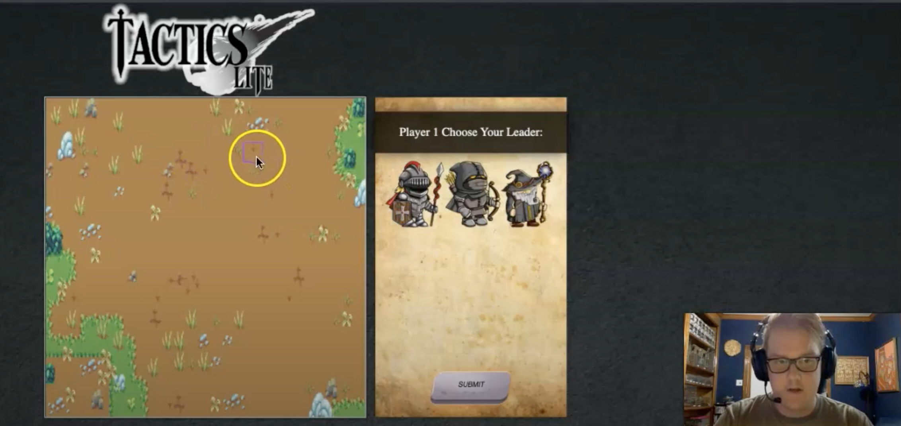

# Tactics Lite

Tactics Lite is a strategy game built in VanillaJS. Two users face off and build a team to defeat one another, via turns, on a grid like map.

The inspiration for the game stemmed from a lot of different games such as Final Fantasy, Shining Force, and Fire Emblem. This game was built with the intention to constantly be updating and improving on several developmental levels.


# Demo

👉 Watch it <a href="https://www.youtube.com/watch?v=A7PIuR2VSYE">here!</a>




# Prerequisites

Before you start the game, ensure you follow these steps:

<h3>Backend</h3>

- change directories into "backend"
```
    $ cd backend
```

- installed the latest version of rails
```
    $ gem install rails
```

- You will need to start the server next
```
    $ rails s
```

<h3>Frontend</h3>

- open up a second terminal

- in the second terminal change directories
```
    $ cd frontend
```

- start up the server
```
    $ open index.html
```


# Features

✅ Two Player System

✅ Team Turn Based

✅ Class System

✅ Balanced / Diverse Class Stats

✅ Canvas Grid like Map


# Rule Set

Each User selects a Leader to lead their team in the battle. Each available Leader to choose from is a stronger version of the Minion classes. The classes are Fighter, Archer, and Mage. (More information on classes below) A team will consist of 4 units total, 1 Leader and 3 Minions. Once both Users have chosen their team, they can drag their team anywhere on the highlighted part of the board to set their locations for the start of the battle.

When both sides are ready, they will hit a Ready Check button and the game will start. Players take turns moving and acting with their team to defeat the opposing team. A turn consist of one User moving and acting with all of their units. Once every unit has been moved or acted once in the turn, they become unable to move until the next turn and the opposing team's turn starts. Once all of the units from one team are defeated, the standing team wins.

Strategy will be key in this game, as there will be several different tactics you can use, both in choosing your team and the way you play your team in the battle. Taking the time to understand the classes will help in this area.


# Classes

Stats marked with a * are rolled randomly between the two values when a minion is chosen at the beginning of the battle. Leader stats are fixed.

⚔️ Fighter - A Melee class that fights with a 2h Axe that needs to be within 1 space of an enemy unit to attack. A Fighter will have more HP than an Archer or Mage class. They are a rounded warrior that doesn't attack with big numbers, but will survive longer than the other two classes.

Example Stats: (HP, ATK, ATK Range, and Movement are the only ones implemented at the moment, but DEF and AGI will be added for different functions later)

- HP (Health Points) 50 - 75 *
- ATK 8 - 12 *
- ATK Range 1 Space
- Movement 4 Spaces


🏹 Archer - A Ranged class that fights with a Bow and arrow. The attack range is 3 spaces outward from the unit. An Archer has advantage of ranged attack and a balance of HP and ATK. They take advantage from the backlines and can put pressure for your frontline to advance. 

Example Stats:

- HP 45 - 65 *
- ATK 9 - 11 *
- ATK Range 3 Spaces
- Movement 3 Spaces


🧙‍♂️ Mage - A Ranged Caster class that fights with spells. (To accomplish basic functions of the base game, Mages will be set to rudimentary functions until further development is made to add things such as "Magic Dmg", "MP (Magic Points)", and "Area of Effect Dmg") The attack range is 2 spaces outward from the unit and the targetting is single target, until further development. In the base game, the ATK will be boosted to adhere to disadvantages that come without specific class functions. Since base functions are only implemented, ATK will reflect this. 

Example Stats:

- HP 35-50 *
- ATK 15-20 *
- ATK Range 2 Spaces
- Movement 3 Spaces


# Leaders

There is a predetermined list of names for the Leaders, but there should be an option for them to change the "nickname" of the Leader when they choose one.

⚔️ Unloden Pendragon (Fighter Class) - A knight that risen through the ranks and now leads and commands the Royal Mercenary Allegiance. Unloden is a Fighter class and wields an Obsidian Carved Great Axe. A fierce and brash Fighter that stands toe to toe with his foes. Fixed stats are shown below.

Stats:

- HP 145
- ATK 13
- ATK Range 1 Space
- Movement 5 Spaces


🏹 Valwren (Archer Class) - A wiery commoner that has made a name for himself. His bow and his quick witted retorts are what make this Archer a sizable leader. Leaving this one to the shadows will have its consequences. Fixed stats are shown below.

Stats: 

- HP 125
- ATK 12
- ATK Range 3 Spaces
- Movement 5 Spaces


🧙‍♀️ Agitha Stormbrower (Mage Class) - An unseamingly ageless sage that only appears among the common in times of war. She devestates battlefields with her love for the Wind Affinity. Fixed stats are shown below.

Stat:

- HP 90
- ATK 20
- ATK Range 2 Spaces
- Movement 5 Spaces


# User Stories

<bold>MVP</bold>

- User can pick a Leader and Team
- User can set Leader's name
- User can check Ready to start the game
- User can set Minion locations at start of the game
- User can control individual Minions through turns
- Both users can affect one another's "stats" (HP)
- A game will end when one team is left standing

<bold>Stretch Goals</bold>

- Add "Items" that heal HP
- Dynamic Board / Terrain affects / Damage affected by Terrain
- Persisting "Teams" to use in future battles. (Accout setup)
- Create Custom 2D Models for Leaders & Minions
- Additional Costume types for Character Models

# Model Relationships

<bold>Game</bold>

- has_one :board
- has_many :actions
- has_many :players
- has_many :users, through: :players


<bold>User</bold>

- has_many :players
- has_many :games, through: :players


<bold>Board</bold>

- belongs_to :game


<bold>Actions (Move, Attack, Wait, Stats)</bold>

- belongs_to :game
- belongs_to :player
- belongs_to :minion


<bold>Player</bold>

- belongs_to :game
- belongs_to :user
- has_many :minions
- has_many :actions, through: :minions


<bold>Minion</bold>

- belongs_to :player
- has_many :actions


# Built With


# Contributing to Tactics Lite

To contribute to Tactics Lite, follow these steps:

    1. Fork this repository.
    2. Create a branch: git checkout -b <branch name>.
    3. Make your changes and commit them: git commit -m "<commit message>"
    4. Push to the original branch: git push origin <project_name>/<location>
    5. Create a pull request.


# Contributers

A special thanks to those who have contributed to this project:

    @Tneebs
    @kirirotha


# Contact

If you would like to contact me you can reach me at tedneben@gmail.com
